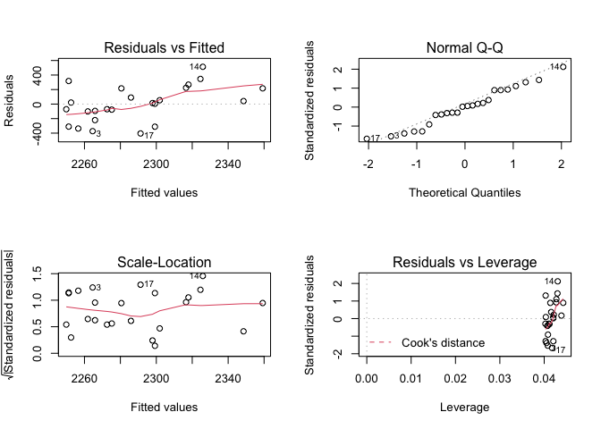

## Анализ зависимости количества обращений пользователей от числа обслуживаемых рабочих мест

Целью анализа является верификация модели, выявлеющей закономерность в количестве обращений пользователей от числа обслуживаемых рабочих мест.


```r
library(readxl)
SCandPC.raw <- read_excel("Data.xlsx")
dim(SCandPC.raw)
```

```
## [1] 120   5
```

```r
head(SCandPC.raw)
```

```
## # A tibble: 6 x 5
##    Year Month Org      SC    PC
##   <dbl> <dbl> <chr> <dbl> <dbl>
## 1  2018     1 Org_1    76    73
## 2  2018     1 Org_2   234   212
## 3  2018     1 Org_3   862   564
## 4  2018     1 Org_5   935   718
## 5  2018     1 Org_4    54   129
## 6  2018     2 Org_1    83    73
```
# Регрессионный анализ

Проведем анализ только по всем предприятиям, для чего просуммируем данные по всем предприятиям для каждого периода и построим линейную модель КМНК.


```r
SCandPC.sum<-aggregate(cbind(PC,SC)~Month+Year,data=SCandPC.raw,sum)
dim(SCandPC.sum)
```

```
## [1] 24  4
```

```r
head(SCandPC.sum)
```

```
##   Month Year   PC   SC
## 1     1 2018 1696 2161
## 2     2 2018 1699 2045
## 3     3 2018 1698 1892
## 4     4 2018 1687 2179
## 5     5 2018 1692 1920
## 6     6 2018 1688 1941
```

```r
summary(lm0<-lm(SC~PC-1,data=SCandPC.sum))
```

```
## 
## Call:
## lm(formula = SC ~ PC - 1, data = SCandPC.sum)
## 
## Residuals:
##     Min      1Q  Median      3Q     Max 
## -404.22 -130.88    9.44  216.53  513.10 
## 
## Coefficients:
##    Estimate Std. Error t value Pr(>|t|)    
## PC  1.33366    0.02941   45.34   <2e-16 ***
## ---
## Signif. codes:  0 '***' 0.001 '**' 0.01 '*' 0.05 '.' 0.1 ' ' 1
## 
## Residual standard error: 247.2 on 23 degrees of freedom
## Multiple R-squared:  0.9889,	Adjusted R-squared:  0.9885 
## F-statistic:  2056 on 1 and 23 DF,  p-value: < 2.2e-16
```

```r
oldpar<-par(mfrow=c(2,2))
plot(lm0)
```

<!-- -->

```r
par(oldpar)
```
Проведем тесты на авторегерессию и гетероскедатичность


```r
library(car)
```

```
## Loading required package: carData
```

```r
acf(residuals(lm0))
```

<!-- -->

```r
ncvTest(lm0)
```

```
## Non-constant Variance Score Test 
## Variance formula: ~ fitted.values 
## Chisquare = 0.2684338, Df = 1, p = 0.60438
```

